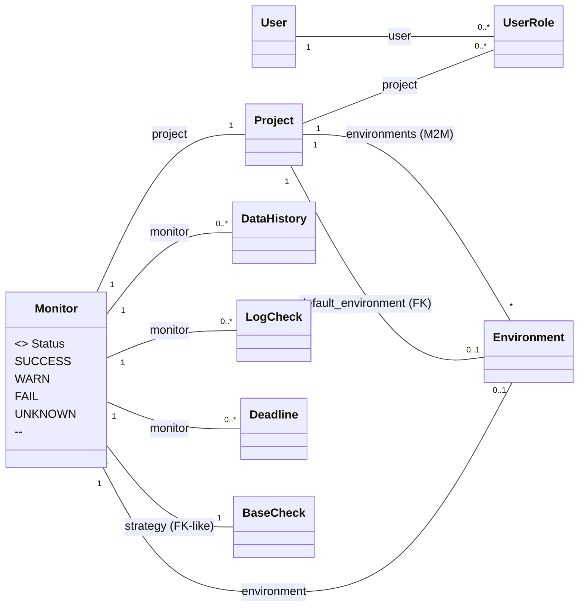

# Birder Models Diagram

```mermaid
classDiagram
    direction LR

    class User {
    }

    class Project {
    }

    class Environment {
    }

    class UserRole {
    }

    class Monitor {
        <<enumeration>> Status
        SUCCESS
        WARN
        FAIL
        UNKNOWN
        --
    }

    class DataHistory {
    }

    class LogCheck {
    }

    class Deadline {
    }

    class BaseCheck {
    }

    User "1" -- "0..*" UserRole : user
    Project "1" -- "0..*" UserRole : project
    Project "1" -- "*" Environment : environments (M2M)
    Project "1" -- "0..1" Environment : default_environment (FK)
    Monitor "1" -- "1" Project : project
    Monitor "1" -- "0..1" Environment : environment
    Monitor "1" -- "0..*" DataHistory : monitor
    Monitor "1" -- "0..*" LogCheck : monitor
    Monitor "1" -- "0..*" Deadline : monitor
    Monitor "1" -- "1" BaseCheck : strategy (FK-like)
```
