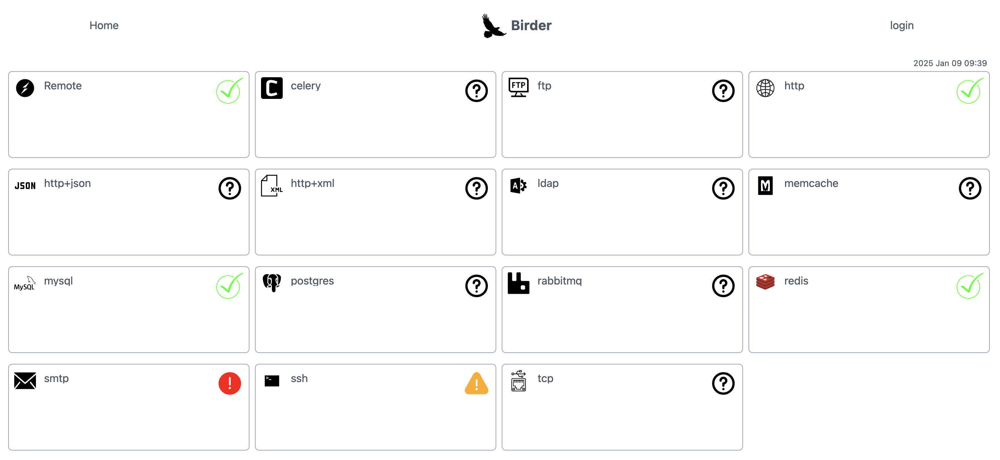

Birder is an Open source service uptime monitor.
It is not intended to be a replacement of Nagios or other system administrator's monitoring tools,
it has been designed to be simple and easy do deploy on any environment,
its audience is web site users to display SLA compliance and systems availability.
